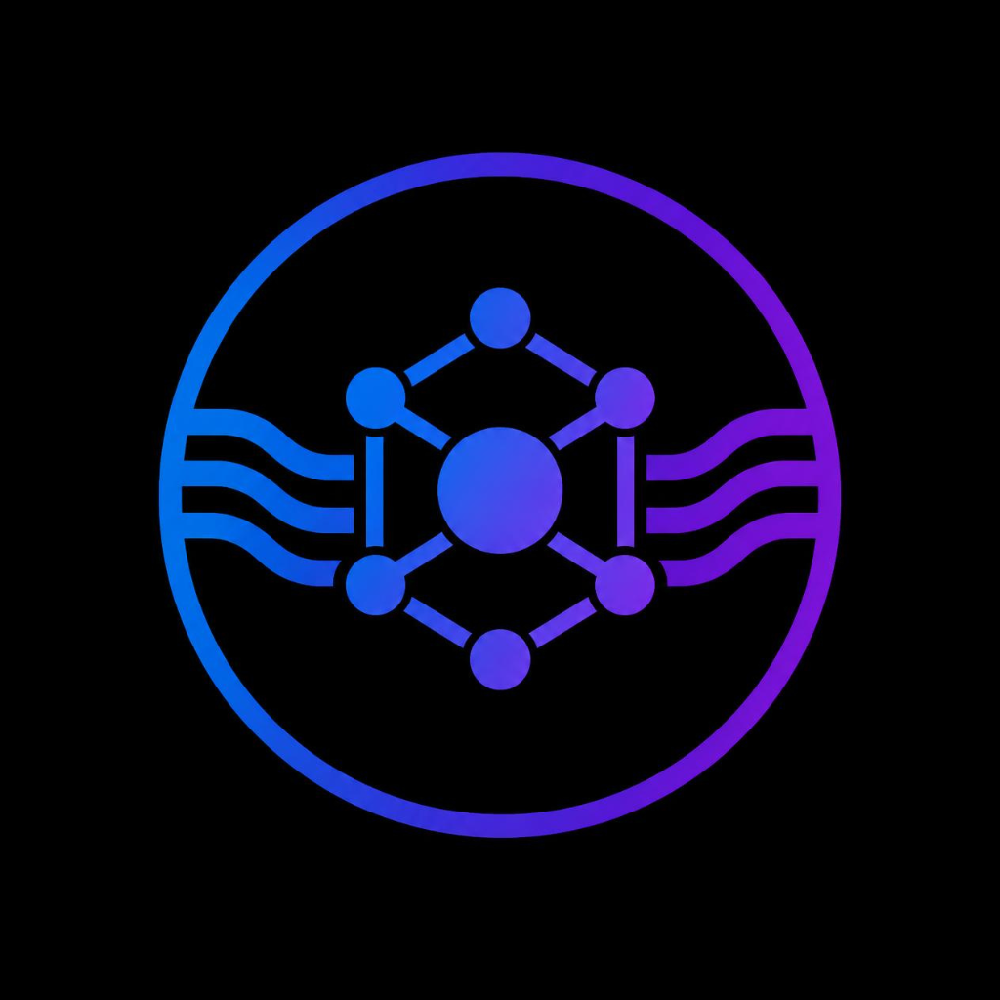

<div align="center">
  
  
  # ML Studio
  **The Zero-Code Machine Learning Pipeline Engine**

  [](https://reactjs.org/)
  [](https://nodejs.org/)
  [](https://fastapi.tiangolo.com/)
  [](https://scikit-learn.org/)
  [](https://docs.bullmq.io/)
  [](https://groq.com/)
</div>

---

## 🚀 Overview

**ML Studio** is an automated, end-to-end Machine Learning pipeline engine. Drop a CSV dataset into the UI, and the engine will automatically clean the data, impute missing values, handle categorical encoding, train an ensemble of models (Random Forest, Gradient Boosting, Multi-Layer Perceptrons), and perform unsupervised clustering—all in a single click.

The platform features an embedded **AI Copilot** powered by Groq (Llama 3). The Copilot acts as a "Data Doctor", analyzing your dataset for data leakage, extreme class imbalances, and outlier skewness, and can dynamically re-run your pipelines with custom configurations via natural language.

---

## ✨ Features

- **Automated EDA & Preprocessing**: Automatically detects numerical vs categorical columns, applies robust scaling, one-hot encoding, and drops highly correlated/leaky features.
- **Supervised Ensembles**: Trains and hyperparameter-tunes Random Forests, Gradient Boosting Machines, and Voting Classifiers.
- **Deep Learning**: Optionally trains a Multi-Layer Perceptron (MLP) neural network with early stopping and dynamic learning rate reduction.
- **Unsupervised Learning**: Automatically projects high-dimensional data using PCA, and clusters it using K-Means (optimized via Silhouette analysis) and Agglomerative Hierarchical clustering.
- **Interactive Dashboards**: Visualizes ROC Curves, Confusion Matrices, Feature Importances, PCA scatter plots, and multi-metric Radar Charts using Recharts.
- **AI Insights**: Every chart on the dashboard includes an embedded AI-generated analysis block, explaining the metrics in plain English.
- **Jupyter Export**: Click "Export to Jupyter" to instantly download your optimal pipeline as a fully runnable `.ipynb` notebook.

---

## 🏗️ Architecture

ML Studio is built on a scalable microservice architecture to prevent heavy ML training jobs from blocking the main web server.

1. **Frontend (`/client`)**: React + Vite + Tailwind CSS.
2. **Orchestrator API (`/server`)**: Node.js + Express. Handles file uploads and AI Copilot routing.
3. **Message Queue**: Redis + BullMQ. Safely queues intensive ML tasks.
4. **ML Engine (`/ml-engine`)**: Python + FastAPI + Scikit-Learn. A dedicated background worker that executes the pipelines and fires webhooks back to the Node API when finished.

---

## 💻 Local Setup (Docker)

The absolute easiest way to run ML Studio locally is using Docker Compose, which automatically builds and networks all 4 containers (React, Node, Python, Redis).

1. Clone the repository:
   ```bash
   git clone https://github.com/Vishal-Singh27/ML-Studio.git
   cd ML-Studio
   ```
2. Create a `.env` file in the `server` directory and add your Groq API Key:
   ```env
   GROQ_API_KEY=gsk_your_api_key_here
   ```
3. Boot up the entire stack:
   ```bash
   docker-compose up -d --build
   ```
4. Open [http://localhost:5173](http://localhost:5173) in your browser!

---

## ☁️ Production Deployment (Zero-Cost)

ML Studio is optimized to be deployed completely for free using **Render** and **Upstash**.

1. **Redis**: Create a free Serverless Redis database on [Upstash](https://upstash.com/). Copy the `rediss://` URL.
2. **Render**: Sign into [Render.com](https://render.com/), click **New Blueprint**, and connect your GitHub repository.
3. Render will read the `render.yaml` file in this repository and automatically provision the React UI, Node Server, and Python Engine.
4. When prompted, paste your `GROQ_API_KEY` and the `REDIS_URL` you got from Upstash.

Render will automatically configure the internal networking, set up HTTPS, and deploy your live URL!

---

## 📝 License

Distributed under the MIT License. See `LICENSE` for more information.
